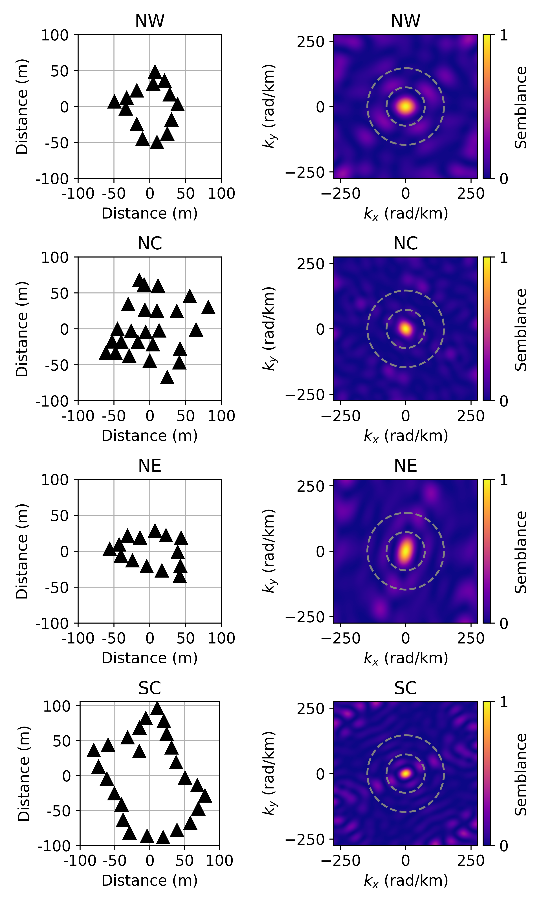
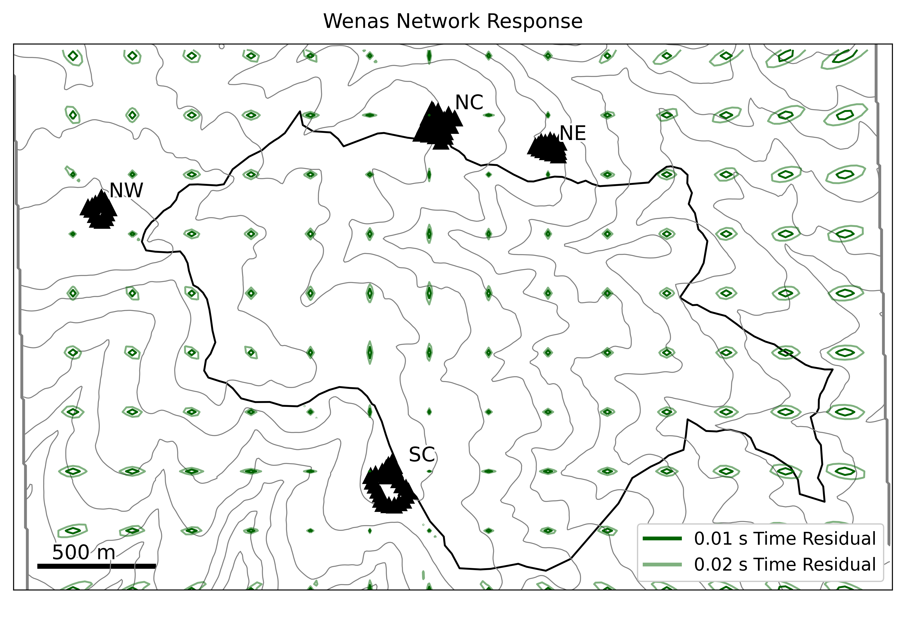

# Infrasound Signals from Wenas, WA Prescribed Burn
Code and results from infrasound data collected at the Wenas, WA prescribed burn on 06-10 Oct 2026.

## Field Site

## Data Collection
<figure>

    
    <figcaption>Array geometry (left) and array response (right) for arrays deployed around the burn unit perimeter.</figcaption>

</figure>

<figure>

    
    <figcaption>Infrasound network response, showing 0.1s (1 sample) time residuals as dark green contours.</figcaption>

</figure>

## Beamforming Results

## Triangulated Source Locations

